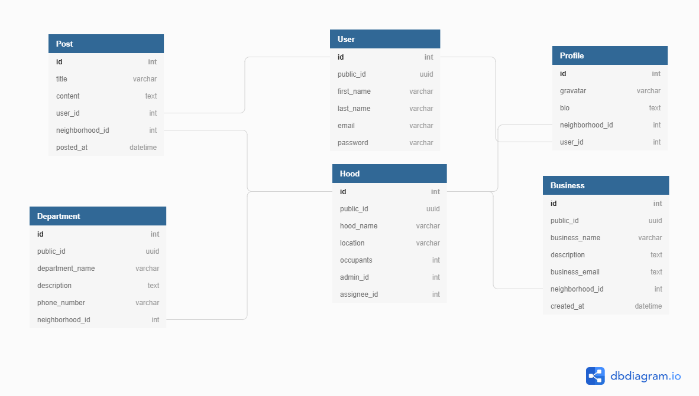

# Neighbourhood App

[](https://travis-ci.com/HannesKimara/NeighborhoodApp)
[](https://codecov.io/gh/HannesKimara/NeighborhoodApp)
[](https://opensource.org/licenses/MIT)

## Description
Neighboorhood API helps you keep up with events in your neighborhood. A user can list a business to be in the neighborhood and other residents can find businesses in the area, departments such as fire department and posts by other residents.

## Design
#### Database Implementation


## Getting Started
To get started run this in a virtual environment:
```bash
$ git clone https://github.com/HannesKimara/NeighborhoodApp.git
$ cd awwwards
$ python -m pip install -r requirements.txt
```

You'll need to create a '.env' file with the following values replaced to match:
```bash
SECRET_KEY=<YOUR_SECRET_KEY>
DATABASE_URL=<YOUR_DATABASE_URL>
DISABLE_COLLECTSTATIC=1
ALLOWED_HOSTS=<YOUR_ALLOWED_HOSTS>
DEBUG=<BOOL>
```

Run migrations and start server:
```bash
$ python manage.py migrate
$ python manage.py runserver
```

## Testing
To run unittests run the following command in root directory:
```bash
$ python manage.py test
```
All tests should pass

## Author
This project was created and is maintained by Hannes Kimara

## License
This is licensed under MIT License Copyright(2020) Hannes Kimara